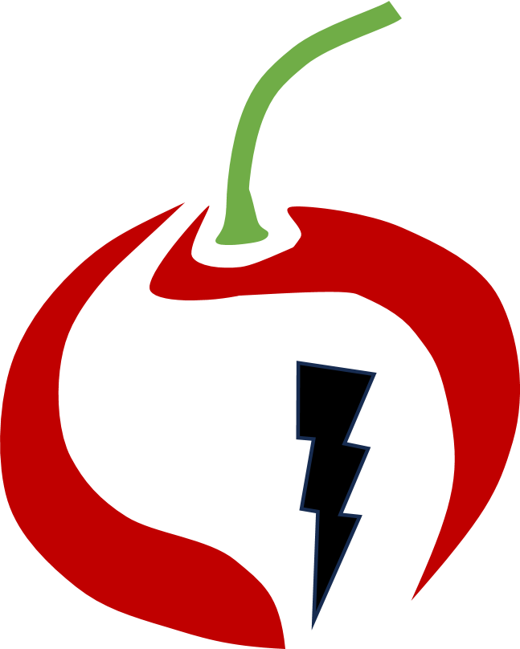
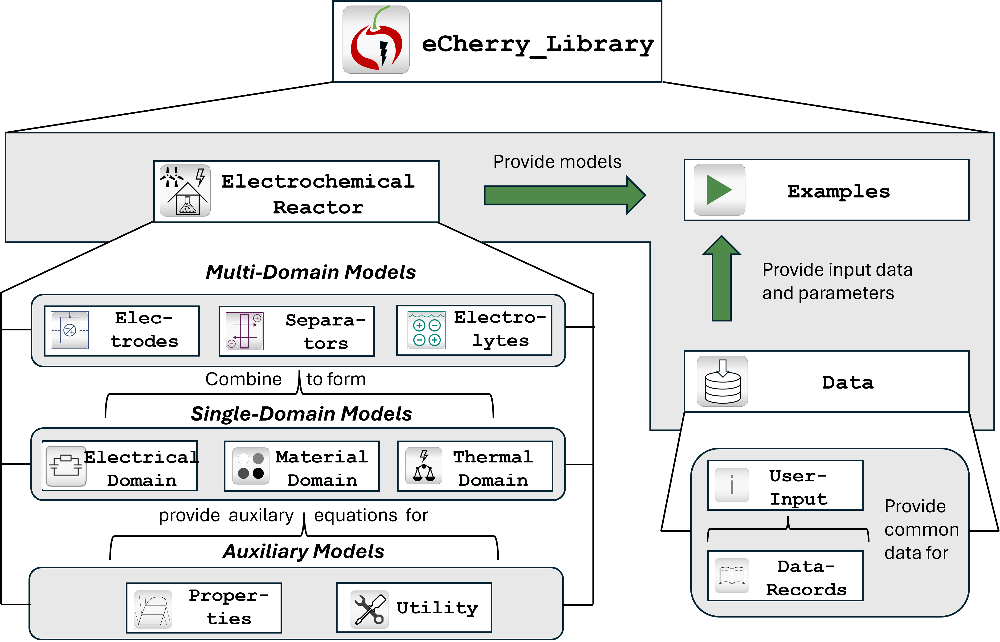

<table style="border: none; border-collapse: collapse;">
<tr>
<td style="border: none;"></td>
<td style="border: none;"><h1>eCherry Model Generator</h1></td>
</tr>
</table>

This project provides a lightweight model-driven pipeline for generating
[eCherry](https://git.rwth-aachen.de/avt-svt/public/echerry) electrochemical
reactor models written in [Modelica](https://modelica.org/) — an
equation-based, object-oriented modelling language used in simulation tools
such as Dymola and OpenModelica. Users describe a reactor configuration in a
concise domain-specific language (DSL) of 41–50 lines; the pipeline parses
that description, validates it, transforms it into an intermediate
representation, and generates a fully-wired eCherry-compatible Modelica
artefact of 100–200 lines that conforms to the eCherry component API. The
project is implemented in Python as a lightweight front end for generating
eCherry-compatible Modelica artefacts, covering alkaline water electrolysis
(AWE) in 0D and 1D variants and alkaline ammonia electrolysis (AAE).



---

## Pipeline Overview

```
.reactor file
     │
     ▼
  parser              Reads a .reactor DSL file line-by-line; returns an intermediate dict.
     │
     ▼
model construction    Maps parsed data into Python dataclasses (ReactorModel, GeometryParams, …).
     │
     ▼
 validator            Runs nine semantic checks; fails fast with a clear error message.
     │
     ▼
transformer           Maps ReactorModel → GeneratorContext dict; resolves eCherry FQNs.
     │
     ▼
 generator            Renders two Jinja2 templates against the context dict.
     │
     ▼
Model.mo + UserInput.mo
```

---

## Reactor Families Supported

| Family | `setup` value | `electrolyte_mode` | Special features | Gold standard in eCherry? |
|---|---|---|---|---|
| Continuous 0D AWE simple | `continuous_0D_alkaline` | `simple` | Baseline alkaline water electrolysis | Yes |
| Continuous 0D AWE KOH | `continuous_0D_alkaline` | `KOH` | KOH conductivity model | Yes |
| Batch 0D AWE simple | `batch_0D_alkaline` | `simple` | Single shared electrolyte; no flow components or separator | Yes |
| Batch 0D AWE KOH | `batch_0D_alkaline` | `KOH` | Batch topology with KOH conductivity — **novel combination, no eCherry gold standard** | No |
| Continuous 0D ammonia | `continuous_0D_ammonia` | — | Gas diffusion cathode, gas channel compartment, NRR reaction | Yes |
| Continuous 1D alkaline | `continuous_1D_alkaline` | `simple` | Diffusion boundary layers (`Electrolyte_Batch_1D_L_nLayers`) and connection layers between electrodes and bulk | Yes |

---

## Quick Start

**Requirements:** Python 3.11 or later.

```bash
# 1. Clone the repository and enter the project directory
git clone <repo-url>
cd eCherry_Model_Generator

# 2. Create and activate a virtual environment
python -m venv .venv
source .venv/bin/activate        # macOS / Linux
# .venv\Scripts\activate         # Windows

# 3. Install dependencies
pip install -r requirements.txt
```

### Option A — Interactive wizard (recommended)

The wizard guides you through every parameter with defaults pre-filled for
each reactor family. The quickest way to verify the project is to run the
wizard, generate a DSL file, and inspect the resulting `Model.mo` and
`UserInput.mo` files in `results/generated/`.

```bash
python reactor_builder.py
```

The wizard validates inputs (negative voltage enforced, array lengths
checked, filename collision protection) and automatically runs the generator
when you finish.

### Option B — Run a DSL file directly

```bash
python run.py dsl/example_conti_simple.reactor
```

Output is written to:

```
results/generated/example_conti_simple/
    Model.mo
    UserInput.mo
```

The subdirectory name comes from the DSL filename (without `.reactor`). The
files inside are always named `Model.mo` and `UserInput.mo`.

---

## Project Structure

```
eCherry_Model_Generator/
├── reactor_builder.py            # Interactive wizard — collects parameters, writes DSL, runs generator
├── run.py                        # CLI entry point: python run.py dsl/<file>.reactor
├── requirements.txt              # jinja2, pytest
│
├── src/
│   ├── parser/parser.py          # Hand-written line-by-line parser → intermediate dict
│   ├── metamodel/metamodel.py    # Python dataclasses (ReactorModel and component types)
│   ├── validator.py              # Nine semantic checks; raises ValueError on failure
│   ├── transform/transformer.py  # ReactorModel → GeneratorContext dict with resolved FQNs
│   └── generator/
│       ├── generator.py          # Renders Jinja2 templates and writes output files
│       └── templates/
│           ├── top_model.mo.j2   # Generates Model.mo (component declarations + equations)
│           └── user_input.mo.j2  # Generates UserInput.mo (data records)
│
├── dsl/                          # Example DSL files, one per reactor family
│   ├── example_conti_simple.reactor
│   ├── example_conti_koh.reactor
│   ├── example_batch_simple.reactor
│   ├── example_batch_koh.reactor
│   ├── example_conti_ammonia.reactor
│   └── example_conti_1d_simple.reactor
│
├── results/
│   ├── generated/                # Generator output — one subdirectory per DSL file
│   └── manual/                   # Reference .mo files copied from the eCherry library
│
└── tests/
    └── test_pipeline.py          # 84 pytest tests covering validation and all six supported families
```

---

## DSL Reference

Every reactor is described in a `.reactor` file. Below is the complete
`example_conti_simple.reactor` — the baseline configuration:

```text
reactor AWE_Conti_Simple {
  setup: continuous_0D_alkaline
  electrolyte_mode: simple
  voltage: -2.5

  species: [O2, H2, Hp, OHm, H2O]

  reactions {
    anode:   OERdummy
    cathode: HERdummy
  }

  geometry {
    X:          0.01
    X_membrane: 0.0005
    Y:          1.0
    Z:          1.0
    cond0:      1.0
    dX:         1e-6
  }

  conditions {
    T0:           300
    Tenvironment: 293.15
    p:            1
  }

  concentrations: [0, 1.45e-12, 1e-4, 6000, 55e3]

  electrolyte {
    kappa_anode:   75
    kappa_cathode: 85
  }

  diaphragm {
    kappa: 38
  }

  simulation {
    stop_time: 50
  }
}
```

### Available `setup` values

| Value | Description |
|---|---|
| `continuous_0D_alkaline` | Continuous flow cell with two electrolyte compartments and a diaphragm separator |
| `batch_0D_alkaline` | Batch cell with a single shared electrolyte; no flow components or separator |
| `continuous_0D_ammonia` | Continuous cell with a gas diffusion cathode, gas channel compartment, and NRR reaction |
| `continuous_1D_alkaline` | Continuous cell with 1D diffusion boundary layers on each electrode side |

### Available `electrolyte_mode` values

| Value | Description |
|---|---|
| `simple` | Constant conductivity (`kappa_const`) set from the `electrolyte` block |
| `KOH` | Replaces the conductivity model with `ConductivityElectrolyteCalcKOH` |

`electrolyte_mode` is not used for `continuous_0D_ammonia`.

### Setup-specific DSL blocks

**`diffusion_layer { ... }`** — required for `continuous_1D_alkaline`, omit for all 0D families:

```text
  diffusion_layer {
    X_difflayer:   1e-6
    kappa_anode:   85
    kappa_cathode: 74
    n_slices:      10
  }
```

**`gas_channel { ... }`** — required for `continuous_0D_ammonia`, omit for all other families:

```text
  gas_channel {
    mol_vec_frac0: [0, 0, 1, 0, 0, 0, 0]
    slices: 10
    t: 5
  }
```

**Block-form `concentrations`** — used only for `continuous_0D_ammonia`; all other families use the flat list syntax:

```text
  concentrations {
    electrolyte: [0, 1.45e-12, 0, 0, 6000, 6000, 55e3]
    gas_channel: [0, 0, 1, 0, 0, 0, 0]
  }
```

**`inflow_scale` in `conditions`** — for `continuous_1D_alkaline` only, set explicitly:

```text
  conditions {
    T0:           300
    Tenvironment: 293.15
    p:            1
    inflow_scale: 0.05
  }
```

All 0D families use the default of `0.005` and do not need to specify this.

---

## Generated Output

Running the pipeline on a single DSL file produces two Modelica files:

**`Model.mo`** — the simulation model. Contains:
- `within` package placement clause
- `import` alias for the eCherry library
- Component declarations: electrical ground, voltage source, electrodes,
  electrolyte compartments, separator (where applicable), flow components
  (where applicable), diffusion and connection layers (1D only), gas channel
  compartment (ammonia only)
- `equation` section with `connect()` statements wiring all components
- `annotation` with simulation stop time

**`UserInput.mo`** — the data record. Depending on the family, it contains:
- Species record (`AWEspec` or `AESspec` for ammonia)
- Reaction constants
- Geometry record(s) — `GeoRec` for all families; additionally `GeoRecMem`
  and `GeoRecElec` for ammonia
- Conditions record (`CondRec`)
- Initial concentration data (`c0` for AWE; `c0_Electrolyte` and
  `c0_GasChannel` for ammonia)
- Pressure array `Pi` and molar flow rate array `molFlow_vec` (AWE families
  only)
- `X_difflayer` constant (1D only)
- Gas-channel parameters `mol_vec_frac0`, `slices`, and `t` (ammonia only)

---

## Evaluation

### Line counts

| Configuration | DSL lines | Generated lines (Model + UserInput) | Manual reference lines | Reduction |
|---|---|---|---|---|
| Continuous AWE simple | 42 | 149 | 213 | 80% |
| Continuous AWE KOH | 42 | 150 | 180 | 77% |
| Batch AWE simple | 41 | 101 | 156 | 74% |
| Batch AWE KOH | 41 | 103 | novel — no reference | — |
| Continuous ammonia | 48 | 197 | 281 | 83% |
| Continuous 1D simple | 49 | 183 | 250 | 80% |

### Abstraction

The key abstraction claim: the user writes ~41–50 lines of DSL and the
generator produces ~100–200 lines of correct eCherry Modelica. Changing a
**single line** in the DSL switches the entire generated output:

- `electrolyte_mode: simple` → `electrolyte_mode: KOH` regenerates all
  electrolyte components to use the KOH conductivity model.
- `setup: continuous_0D_alkaline` → `setup: batch_0D_alkaline` eliminates
  the separator, both electrolyte compartments, and all flow components,
  replacing them with a single shared electrolyte.

The `setup` and `electrolyte_mode` flags are treated largely orthogonally in
the current design, so extending one dimension generally does not require
rewriting the entire pipeline.

### Tests

84 tests pass across 7 test classes. No external Modelica runtime is
required — all tests operate on generated text output.

---

## Academic Context

| MDD concept | This project |
|---|---|
| **DSL** | An external textual language (`.reactor` files) with its own syntax, parsed by a hand-written line-by-line parser in `src/parser/parser.py` |
| **Metamodel** | Python dataclasses in `src/metamodel/metamodel.py` (`ReactorModel`, `GeometryParams`, `Electrode`, etc.) define the internal domain model used by the parser, validator, transformer, and generator |
| **Model transformation** | `src/transform/transformer.py` performs a model-to-model transformation: `ReactorModel` (domain model) → `GeneratorContext` dict (Modelica-oriented model) with all eCherry fully-qualified names resolved |
| **Code generation** | `src/generator/generator.py` renders two Jinja2 templates against the `GeneratorContext` dict, producing model-to-text output targeting the eCherry Modelica component API |

---

## Running Tests

```bash
source .venv/bin/activate
python -m pytest tests/ -v
```

| Test class | Covers |
|---|---|
| `TestValidator` | Rejection of invalid inputs (positive voltage, mismatched array lengths, unknown species, unsupported setup, 1D-specific rules) and acceptance of valid configurations |
| `TestContiSimple` | Parser, transformer, and generator for `continuous_0D_alkaline` simple |
| `TestContiKOH` | Parser, transformer, and generator for `continuous_0D_alkaline` KOH |
| `TestBatchSimple` | Parser, transformer, and generator for `batch_0D_alkaline` simple |
| `TestBatchKOH` | Parser, transformer, and generator for `batch_0D_alkaline` KOH |
| `TestAmmoniaConti` | Parser, transformer, and generator for `continuous_0D_ammonia` |
| `TestConti1D` | Parser, transformer, and generator for `continuous_1D_alkaline` |

---

## Limitations and Future Work

- **No simulation automation.** Generated `.mo` files must currently be
  loaded manually into a compatible Modelica tool such as Dymola. Integration
  with buildingspy or a Modelica test runner is not included.
- **`X_difflayer` is a literal constant** in the generated `Model.mo`
  rather than a reference through the `UserInput` record, which limits
  round-trip consistency for the 1D family.
- **Additional reactor families** (e.g. 1D KOH, batch ammonia) can be
  added by following the established extension pattern; each new family
  requires changes to the validator, transformer, templates, a new DSL
  example, and a new test class.
- **The wizard supports only the six implemented configurations.** New
  setup/mode combinations require a corresponding pipeline extension before
  the wizard can offer them.